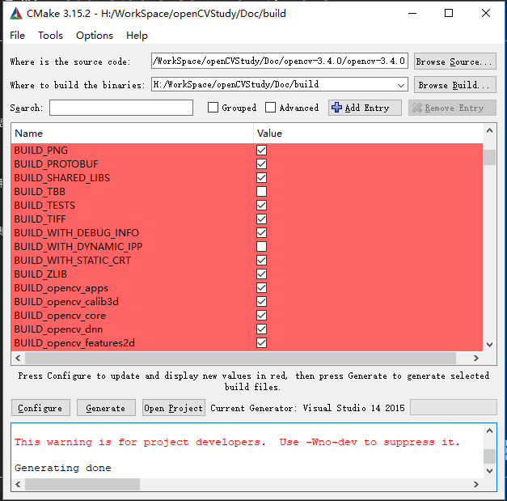

# opencv安装

## 编译好的opencv库和一些源码编译文档

* 使用已经编译好的opencv库
* https://github.com/ZhengPengqiao/OpenCV-MinGW-Build

-------------------------------------------------------------------

## 自己编译opencv库

* 下载Qt，到官网下载即可，我的版本是5.7的
* CMake: 3.15.2
* Opencv: 3.4.0

## cmake安装 （我的版本：cmake-3.15.2）

* cmake-3.15.2-win64-x64.msi
  * 官网下载二进制分发版，地址：https://cmake.org/download/
  * 也可以别的路径下载，官网的下载有点慢
* 安装好cmake后，在qt中配置cmake工具，一般会自动识别到
  * 

## opencv-3.4.0 安装

* Doc中有一份opencv-3.4.0.tar.gz源码
  * 将源码解压到当前目录
* 使用cmake生成vs工程
  * 
  * 后使用visual studio打开工程进行编译 （后面没尝试， 应该会存在编译时的问题）

## 使用qt creater编译

* Doc中有一份Opencv-3.4.0.tar.gz源码
  * 将源码解压到当前目录
* 直接使用Qt打开OpenCV的CMakeList.txt，然后构建套件选择MinGW 32bit/64bit
  * 
* 配置选项WITH_QT,WITH_OPENCV, 构造install
  * 

## 编译错误

* 
  * cmake中去掉ENABLE_PRECOMPILED_HEADERS选项
