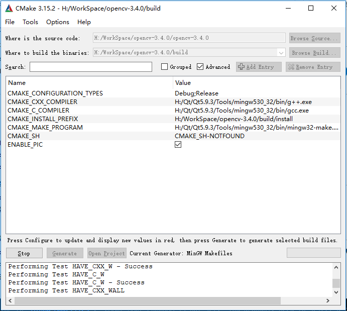

# opencv安装

## 编译好的opencv库和一些源码编译文档

* 使用已经编译好的opencv库
* https://github.com/ZhengPengqiao/OpenCV-MinGW-Build

-------------------------------------------------------------------

## 自己编译opencv库 x64

* 下载Qt，到官网下载即可，我的版本是5.7的
* CMake: 3.15.2
* Opencv: 3.4.0
* MinGW: x86_64-7.2.0

## MinGW安装，QT Creater中只有32bit, 没有64bit的mingw

* 安装mingw程序 mingw-w64-install.exe
* 将mingw64的bin路径添加到path中
  * 

## cmake安装 （我的版本：cmake-3.15.2）

* cmake-3.15.2-win64-x64.msi
  * 官网下载二进制分发版，地址：https://cmake.org/download/
  * 也可以别的路径下载，官网的下载有点慢
* 安装好cmake后，在qt中配置cmake工具，一般会自动识别到
  * 

## cmake opencv-3.4.0

* 选择源码和生产文件路径，点击下方的Configure，选择 MinGW makefiles 及 Specify native compilers
  * 
* 然后编译C文件的路径填gcc.exe(H:/Qt/Qt5.9.3/Tools/mingw530_32/bin/gcc.exe)，同理编译C++文件路径选 g++.exe（H:/Qt/Qt5.9.3/Tools/mingw530_32/bin/g++.exe），fortan那个不填
  * 
* 点击Configure（一般会报错），直到界面无红色面无红色
  * 出现CMAKE_MAKE_PROGRAM没有配置错误， 按照问题1配置
  * 配置选项WITH_QT,WITH_OPENCV
* 点击generate
  * 
* mingw32-make.exe
* mingw32-make.exe install
* 记录下载过程的文件：下载不成功可以手动下载 （感觉使用ll指令查看下文件大小， 如果在变大，说明在下载， 一般很快可以下完）
  * H:\WorkSpace\opencv-3.4.0\build\CMakeDownloadLog.txt
  * 文件位置：H:\WorkSpace\opencv-3.4.0\opencv-3.4.0\.cache

## 使用qt creater编译

* Doc中有一份Opencv-3.4.0.tar.gz源码
  * 将源码解压到当前目录
* 直接使用Qt打开OpenCV的CMakeList.txt，然后构建套件选择MinGW 32bit/64bit
  * 
* 配置选项WITH_QT,WITH_OPENCV, 构造install
  * 

## 编译错误

### 问题1

```c
CMake Error: CMake was unable to find a build program corresponding to "MinGW Makefiles".  CMAKE_MAKE_PROGRAM is not set.  You probably need to select a different build tool.
CMake Error: CMake was unable to find a build program corresponding to "MinGW Makefiles".  CMAKE_MAKE_PROGRAM is not set.  You probably need to select a different build tool.
Configuring incomplete, errors occurred!
```

* 打开advanced
* 
  * CMAKE_MAKE_PROGRAM 配置路径

### 问题2

* 
* cmake时将ENABLE_PRECOMPILED_HEADERS去掉， generate
  * 

### 问题3

* cmake-gui 由于找不到libwinpthread-1.dll  无法继续执行代码
* 方法：将qt的H:\Qt\Qt5.9.3\Tools\mingw530_32\bin    路径加入到系统Path环境变量中。 并重启CMake (cmake-gui)

### 问题4

* 
* 在cap_dshow.cpp_的头部定义忽略安全检查即可，如下
  * #define STRSAFE_NO_DEPRECATE
